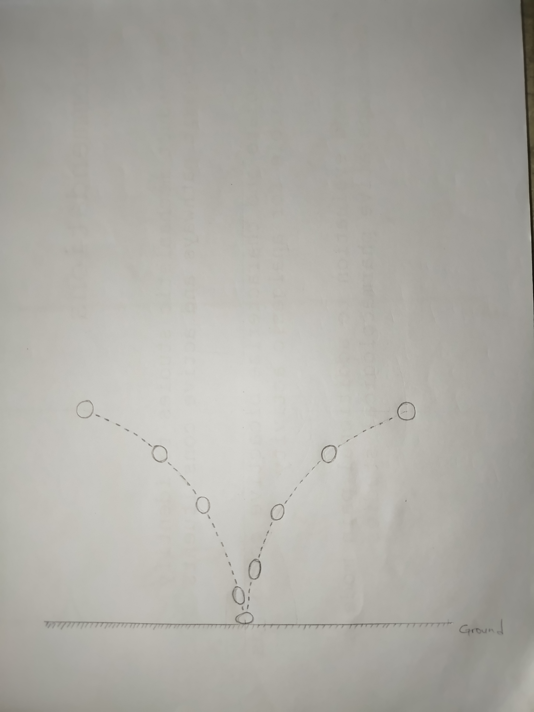
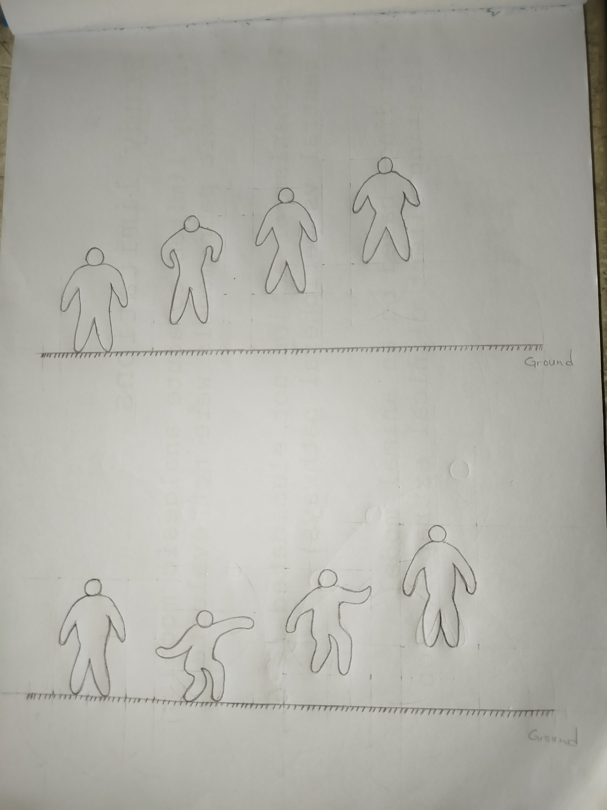
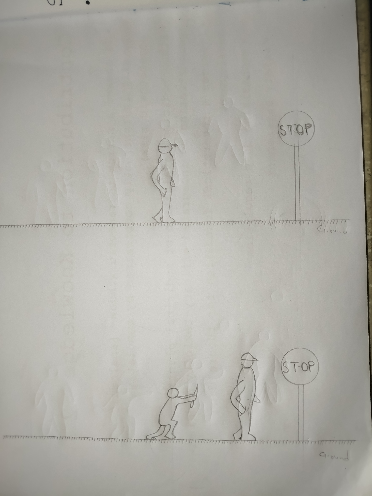
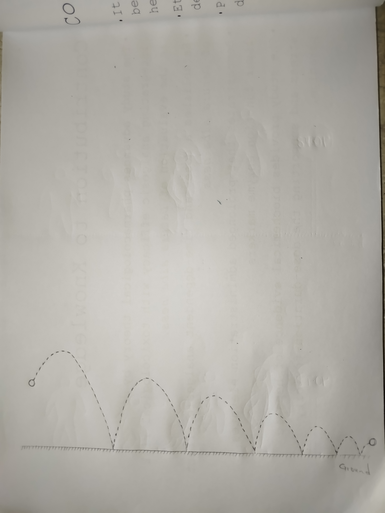

# Module 1 - Week 1 Mini Project: 3D Animation Course
**Name:** Chinakwadom Vitus Nwanehiudu  
**Task:** Observation and Breakdown of a Bouncing Ball using the 12 Principles of Animation

## Overview
For this assignment, I observed the mechanics of a bouncing ball to analyze how the 12 principles of animation apply to simple physics and motion. Below is a breakdown of each principle, its definition, its application to the ball, and its overall effect on the animation. I have included hand-drawn sketches to demonstrate key visual concepts.

---

### 1. Squash and Stretch
* **Meaning:** This principle gives a sense of weight and flexibility to an object by compressing it (squash) upon impact and elongating it (stretch) when it is moving at high speeds.
* **How it applies to the ball:** When the ball hits the ground, the force flattens it. As it bounces back up, it stretches vertically in the direction of the upward movement.
* **Effect on realism/appeal:** It communicates the material of the ball to the viewer. A heavy squash makes it look like soft rubber, preventing it from looking like a rigid bowling ball.

> **Visual Demonstration:**
> 
> *Caption: Illustration showing the ball squashing on impact and stretching as it moves quickly in and out of the bounce.*

### 2. Anticipation
* **Meaning:** Anticipation prepares the audience for a major action, making the movement feel organic rather than sudden. 
* **How it applies to the ball:** In a real-world scenario, anticipation is the moment a hand winds up before throwing the ball. In the bounce cycle itself, anticipation occurs during the split-second the ball hangs suspended at the very top of its arc before gravity pulls it downward. 
* **Effect on realism/appeal:** It builds kinetic energy. My sketch below of a character jumping illustrates this concept: a character must crouch (anticipate) before leaping. The ball hanging in the air serves the same preparatory purpose for the viewer's eye.

> **Visual Demonstration:**
> 
> *Caption: Illustration demonstrating anticipation. The crouching figure at the bottom builds energy before the leap, much like a ball suspended before a drop.*

### 3. Staging
* **Meaning:** Staging is the presentation of an idea so that it is unmistakably clear. It directs the viewer's attention to what is most important in the scene.
* **How it applies to the ball:** To properly observe the mechanics of the bouncing ball, the action must be staged from a clear side-profile view. If staged from a top-down or head-on perspective, the height and arcs of the bounce would be impossible to read. 
* **Effect on realism/appeal:** It ensures the audience immediately understands the narrative of the motion. 

> **Visual Demonstration:**
> 
> *Caption: Illustration of Staging. The top panel clearly focuses on the character's forward journey. The bottom panel shifts the staging focus to the ambush from behind, dictating the viewer's attention.*

### 4. Straight Ahead Action and Pose to Pose
* **Meaning:** These are two different animation workflows. "Straight ahead" means drawing frame by frame from beginning to end. "Pose to pose" means drawing the extremes first, then filling in the gaps.
* **How it applies to the ball:** Animating a bouncing ball is best done using the pose-to-pose method. You establish the highest point of the drop, the exact frame of the squash on the ground, and the peak of the next bounce, before filling in the falling frames.
* **Effect on realism/appeal:** It guarantees the timing, volume, and proportions of the ball remain consistent throughout the entire scene.

### 5. Follow Through and Overlapping Action
* **Meaning:** "Follow through" is the idea that parts of an object continue to move after the main action has stopped. "Overlapping action" means different parts move at different rates.
* **How it applies to the ball:** When the vertical bouncing motion finally decays and stops, the ball's forward momentum *follows through*, causing it to roll along the ground. Additionally, if the ball is spinning while bouncing, that rotation is an overlapping action independent of the up-and-down motion.
* **Effect on realism/appeal:** It proves that the object obeys the laws of physics and inertia, keeping the motion from looking stiff or mechanical.

> **Visual Demonstration:**
> 
> *Caption: Illustration of decaying momentum. The vertical bouncing loses energy, but the forward momentum follows through horizontally.*

### 6. Slow In and Slow Out
* **Meaning:** Movement starts slowly, accelerates, and then decelerates before stopping. 
* **How it applies to the ball:** As the ball reaches the peak of its bounce, it loses upward momentum and slows down (Slow In). As gravity takes over, it accelerates downward, moving fastest right before it hits the ground (Slow Out). 
* **Effect on realism/appeal:** This provides the illusion of gravity and mass.

### 7. Arcs
* **Meaning:** Most natural actions follow a curved trajectory, not sharp, robotic straight lines.
* **How it applies to the ball:** When thrown forward, the bouncing ball travels in smooth, parabolic curves, as seen in my decaying momentum sketch above. 
* **Effect on realism/appeal:** It makes the trajectory fluid and prevents the movement from looking jagged or artificial. 

### 8. Secondary Action
* **Meaning:** Extra, subordinate actions that support the main action without distracting from it.
* **How it applies to the ball:** The primary action is the bounce. A secondary action would be the sound of the impact, a small puff of dust kicking up from the floor when it squashes, or the shadow of the ball growing larger as it approaches the ground.
* **Effect on realism/appeal:** It grounds the ball in a physical environment, making the scene richer and more complex.

### 9. Timing
* **Meaning:** The speed of an action, determined by the number of frames it takes to complete.
* **How it applies to the ball:** The ball moves a larger distance between frames when falling rapidly, and a much shorter distance between frames when slowing down at the top of the arc. 
* **Effect on realism/appeal:** Timing dictates the weight. Fast timing tells the viewer the ball is heavy; slow, floaty timing implies the ball is light like a balloon.

### 10. Exaggeration
* **Meaning:** Pushing an action beyond strict reality to enhance its visual impact.
* **How it applies to the ball:** In real life, a rubber ball only squashes a tiny bit. In animation, we exaggerate the impact by stretching the ball much longer and squashing it much flatter than actual physics would allow.
* **Effect on realism/appeal:** It makes the bounce feel highly energetic, dynamic, and entertaining.

### 11. Solid Drawing
* **Meaning:** Drawing the object so that it feels like it has three-dimensional volume, weight, and balance.
* **How it applies to the ball:** When the ball squashes flat, it must become wider to maintain its total volume. When it stretches upward, it must become thinner.
* **Effect on realism/appeal:** It prevents the ball from looking like a flat, 2D circle that is magically shrinking and growing, keeping the mass believable.

### 12. Appeal
* **Meaning:** Making the design, character, or movement pleasing and interesting to watch.
* **How it applies to the ball:** Combining a perfectly timed bounce, a satisfying arc, and dynamic squash-and-stretch results in a motion that is visually satisfying to the human eye. 
* **Effect on realism/appeal:** It captivates the audience and makes even the simplest physics simulation engaging to observe.
